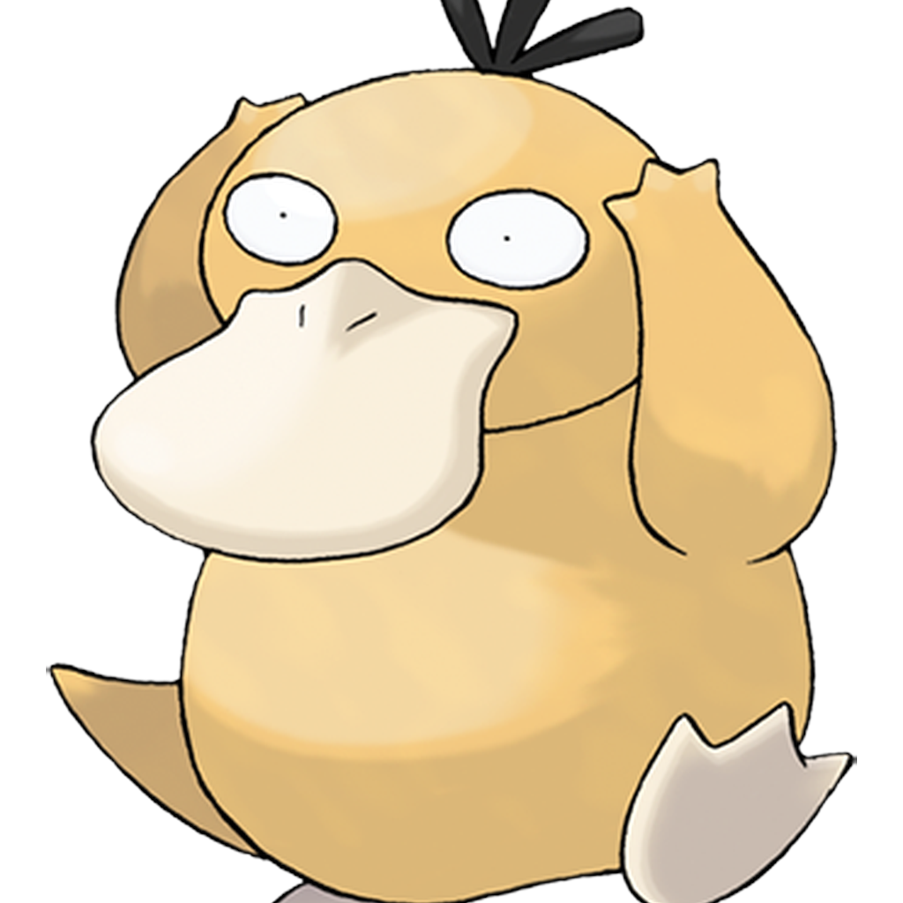

# 🦆 可达鸭桌面宠物

[English](./README.en.md) | 简体中文

一只会在你桌面上溜达的可达鸭。透明窗口、点击穿透、可拖拽、托盘退出——完全的桌面宠物体验。



## ✨ 功能

- 🖼️ **透明背景** — 鸭子浮在桌面上,不遮挡壁纸
- 🖱️ **点击穿透** — 鸭子以外的区域,鼠标点击直达桌面
- ✋ **自由拖拽** — 按住左键把鸭子拖到任意位置
- 🤸 **自动活动** — 鸭子会自己走动、跳跃、思考、发呆、睡觉
- 💬 **气泡对话** — 随机冒出"嘎嘎!""在想事情…"等台词
- 📌 **边缘吸附** — 拖到屏幕边缘会吸附,只露个头
- 🗑️ **托盘退出** — 不占任务栏,右下角托盘图标右键退出

## 📦 下载安装

### Windows
1. 前往 [Releases](../../releases) 下载最新的 `可达鸭 Setup x.x.x.exe`
2. 双击安装
3. 从开始菜单启动「可达鸭」

### macOS
1. 前往 [Releases](../../releases) 下载 `可达鸭-x.x.x.dmg`
2. 打开 dmg,把「可达鸭」拖到「应用程序」
3. **首次打开**:右键点击 app → 「打开」→ 确认(未签名应用需要这样)

## 🎮 使用方法

| 操作 | 效果 |
|------|------|
| 按住左键拖动 | 移动鸭子 |
| 鼠标移开 | 鸭子自己活动(走/跳/睡) |
| 拖到屏幕边缘 | 吸附,只露头部 |
| 鼠标靠近吸附的鸭子 | 滑出来 |
| 右键托盘图标 → 退出 | 关闭程序 |

## 🔧 从源码构建

### 环境要求
- [Node.js](https://nodejs.org/) 18+

### 本地运行
```bash
git clone https://github.com/cs950809/desktop-pet.git
cd desktop-pet
npm install
npm start
```

### 打包
```bash
# Windows
npx electron-builder --win

# macOS(需在 Mac 上执行)
npx electron-builder --mac
```

产物在 `dist/` 目录。

## 🛠️ 技术栈

- **[Electron](https://www.electronjs.org/)** — 跨平台桌面框架
- **透明窗口 + `setIgnoreMouseEvents(forward)`** — 点击穿透的核心机制
- **HTML/CSS/JS** — 鸭子本体与动画

## 📄 许可

本项目仅供学习交流。可达鸭(Psyduck)为宝可梦公司(The Pokémon Company)的角色,相关形象版权归原权利人所有。
